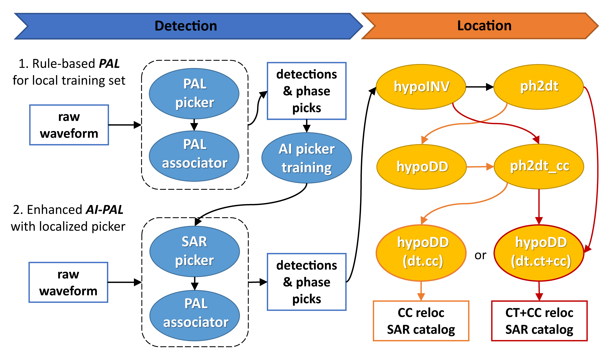

# AI-PAL  
AI-PAL: Localize AI Phase Picker with Rule-based Algorithm for Generalized Earthquake Detection  

## **AI-PAL Workflow**  
  

### 1. PAL  
1.1 phase **P**icking  
1.2 phase **A**ssociation  
1.3 event **L**ocation  

- **Usage** (see *run_pal* for example workdir)  
(1) Prepare continuous data into consistent directory structure  
(2) Run PAL  

### 2. SAR (see *run_sar* for example workdir)  
#### 2.1 Train SAR model  
```bash
python 1_cut_train-samples.py
python 2_sac2zarr.py
python 3_train.py
```  

#### 2.2 Run SAR picker & PAL associator  
```bash
python 4_pick_stream.py
python 5_parallel_assoc.py
```  

#### 2.3 Locate and Relocate SAR-PAL detections  
2.3.1 HypoINV absolute location  
2.3.2 HypoDD double-difference relocation  
2.3.2.1 two-step relocation: dt.ct and dt.cc  
2.3.2.2 one-step relocation: dt.ct + dt.cc joint inversion  

## Tutorials  

2021/10 Online training in Chinese: vedio recording on [KouShare](https://www.koushare.com/lives/room/549779)  
2022/08 Online training in Chinese: vedio recording on [KouShare](https://www.koushare.com/video/videodetail/31656)  

## Installation  

AI-PAL is a set of codes. All you need is to setup proper Python environment. This can be accomplished easily by installing [Anaconda](https://www.anaconda.com/products/individual#Downloads), [Obspy](https://github.com/obspy/obspy/wiki/Installation-via-Anaconda), and [Zarr](https://zarr.readthedocs.io/en/stable/) sequentially.  

### Reference  

- **Zhou, Y.**<sup>`*`</sup>, H. Ding, A. Ghosh, & Z. Ge (2024, under review). AI-PAL: Localize AI Phase Picker with Rule-based Algorithm for Generalized Earthquake Detection. *Journal of Geophysical Research: Solid Earth*  

- **Zhou, Y.**, A. Ghosh, L. Fang<sup>`*`</sup>, H. Yue<sup>`*`</sup>, S. Zhou, & Y. Su (2021). A High-Resolution Seismic Catalog for the 2021 M<sub>S</sub>6.4/M<sub>w</sub>6.1 YangBi Earthquake Sequence, Yunnan, China: Application of AI picker and Matched Filter. *Earthquake Science*; 34(5): 390-398. doi: [10.29382/eqs-2021-0031](https://doi.org/10.29382/eqs-2021-0031)  

- **Zhou, Y.**, H. Yue, L. Fang, S. Zhou<sup>`*`</sup>, L. Zhao, & A. Ghosh (2021). An Earthquake Detection and Location Architecture for Continuous Seismograms: Phase Picking, Association, Location, and Matched Filter (PALM). *Seismological Research Letters*; 93(1): 413–425. doi: [10.1785/0220210111](https://doi.org/10.1785/0220210111)  

- **Zhou, Y.**, H. Yue<sup>`*`</sup>, Q. Kong, & S. Zhou (2019). Hybrid Event Detection and Phase-Picking Algorithm Using Convolutional and Recurrent Neural Networks. *Seismological Research Letters*; 90(3): 1079–1087. doi: [10.1785/0220180319](https://doi.org/10.1785/0220180319)  
